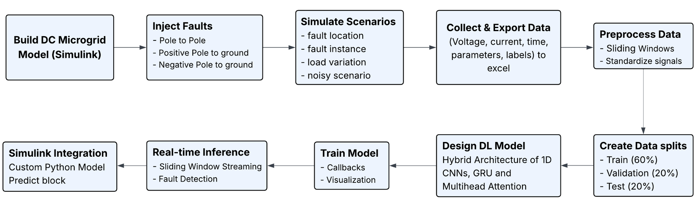
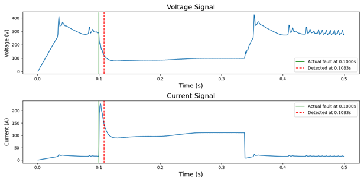

# Real-Time Fault Detection in DC Microgrids using Deep Learning

This project implements and compares deep learning models for the high-speed detection and classification of electrical faults in a DC microgrid system. It includes the complete Python code for data processing, model training, and inference, along with sample data extracted from a MATLAB/Simulink simulation.

## Contact Information

* **Author:** M Bharadwaj

* **Contact:** `madhyalabharadwaj0@gmail.com`

* **GitHub:** `https://github.com/madhyala-bharadwaj`

## System Overview & Methodology

The goal is to identify and classify faults based on voltage and current sensor readings. The project evolved from a CNN+GRU+MHA architecture to a more advanced Transformer-based model for improved accuracy and explainability.

| Microgrid System Architecture |  | 
| --- | --- |
| Dataset Distribution |  |
| Proposed Methodology |  |

## Dataset

The primary dataset consists of time-series voltage and current readings simulated from a complex DC microgrid model in MATLAB/Simulink.

* **Data Files:** `data/pp.xlsx`, `data/ppg.xlsx`, `data/npg.xlsx`

* **Description:** Each file contains samples corresponding to a specific type of fault:

  * `pp.xlsx`: Pole-to-Pole (PP) faults.

  * `ppg.xlsx`: Positive-Pole-to-Ground (PPG) faults.

  * `npg.xlsx`: Negative-Pole-to-Ground (NPG) faults.

* **Important Note:** The provided `.xlsx` files contain **only a small sample** of the full dataset to demonstrate the code's functionality. The models were trained on the complete proprietary dataset to achieve the reported performance metrics. The full dataset cannot be made public. Researchers interested in accessing the full dataset for academic, non-commercial purposes may request access by contacting through mail.

## Project Structure

```
.
├── Matlab/
│   ├── automated_data_extraction.m
│   ├── mat_files_to_excel.m
│   └── saving_data_in_mat_files.m
│
├── Python/
│   ├── data/
│   │   ├── pp.xlsx
│   │   ├── ppg.xlsx
│   │   └── npg.xlsx
│   │
│   ├── waveform_dataset/
│   │   └── (contains 20 pre-processed waveform samples per fault type)
│   │
│   ├── fault_detection_cnn_gru_mha.py
│   ├── fault_detection_transformer_based.py
│   ├── inference_cnn_gru_mha.py
│   ├── inference_transformer_based.py
│   ├── requirements.txt
│   │
│   ├── cnn gru mha architecture.png
│   ├── fault_detection_results.png
│   └── methodology.png
│
├── dataset distribution.png
└── microgrid system.png
```

### File Descriptions

#### `Matlab/`

This folder contains utility scripts for processing the raw simulation output.

* `saving_data_in_mat_files.m`: Saves raw Simulink output to `.mat` files.

* `automated_data_extraction.m`: Extracts relevant signals from `.mat` files.

* `mat_files_to_excel.m`: Converts the extracted data into the `.xlsx` format used by the Python scripts.

* **Note:** The main Simulink model (`.slx`) is proprietary research and is not included.

#### `Python/`

This is the core of the project containing the deep learning models and data.

* `data/`: Contains the sample Excel data files for the main time-series models.
* `waveform_dataset/`: Contains a supplementary dataset of direct waveform images.
* `fault_detection_transformer_based.py`: **(Recommended)** The main training script for the final, high-performance Transformer-based model.
* `fault_detection_cnn_gru_mha.py`: The training script for an alternative model using CNN, GRU, and Multi-Head Attention.
* `inference_transformer_based.py`: Standalone script to run live predictions using the trained Transformer model.
* `inference_cnn_gru_mha.py`: Standalone script for live predictions using the CNN+GRU+MHA model.
* `requirements.txt`: A list of all necessary Python packages.

## Additional Waveform Dataset

This repository also includes a supplementary dataset located in the `Python/waveform_dataset/` directory.

* **Content:** This dataset contains a very small collection of 20 pre-processed waveform samples for each fault type.
* **Format:** The data is structured as direct waveform images, suitable for simpler CNN models that do not require the complex time-series preprocessing used in the main project scripts.
* **Purpose:** This dataset is provided as a resource for users who wish to experiment with building their own lightweight CNN classifiers. Please note that the specific code to train a model on this particular dataset is not included in this repository.

## How to Run

### Prerequisites

* Python 3.9+

* MATLAB (if you wish to use the data extraction utilities)

### 1. Setup Environment

First, clone the repository and set up a virtual environment.

```
# Clone the repository
git clone https://github.com/madhyala-bharadwaj/Real-Time-Fault-Detection-in-DC-Microgrids-using-Deep-Learning
cd Real-Time-Fault-Detection-in-DC-Microgrids-using-Deep-Learning/Python

# Create and activate a virtual environment
python -m venv venv
source venv/bin/activate  # On Windows, use `venv\Scripts\activate`
```

### 2. Install Dependencies

Install all required Python packages using the `requirements.txt` file.

```
pip install -r requirements.txt
```

### 3. Run the Training Pipeline

Execute the main training script. The Transformer-based model is recommended as it provides the best performance.

```
python fault_detection_transformer_based.py
```

This script will:

* Process the data from the `data/` folder.

* Train the Transformer model.

* Evaluate the model and print a classification report.

* Save the trained model (`transformer_model/`) and scalers (`scalers.pkl`).

* Generate XAI plots like SHAP analysis and attention heatmaps.

### 4. Run Inference

After training, you can use the inference script to make predictions on new data. The script is pre-configured to use the sample data provided.

```
python inference_transformer_based.py
```

This will load the trained model and scalers, process a sample stream, and print live fault predictions to the console.

## Results

The final Transformer-based model achieves an overall accuracy of **99.6%** on the test set, successfully classifying all fault types with high precision and recall.

The inference scripts produce a plot visualizing the exact moment a fault is detected in a signal, confirming the model's real-time capabilities.

| Inference Output Example |
| --- |
|  |

---

## Contributing

Suggestions, bug reports, and feedback are welcome. Please feel free to open an issue in the GitHub repository.

## How to Cite

If you use this code or the accompanying dataset in your research, please cite it as follows:

```
@misc{bharadwaj_dc_fault_detection_2025,
  author = {M Bharadwaj},
  title = {Real-Time Fault Detection in DC Microgrids using Deep Learning},
  year = {2025},
  publisher = {GitHub},
  howpublished = {\url{https://github.com/madhyala-bharadwaj/Real-Time-Fault-Detection-in-DC-Microgrids-using-Deep-Learning}}
}
```

## License

This project is licensed under the MIT License. See the accompanying `LICENSE` file for details.

